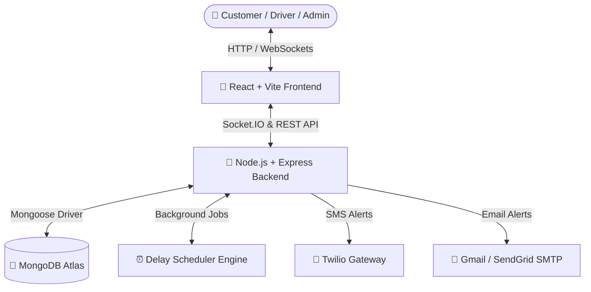

# 🚚 TrackFlow — Enterprise Real-Time Shipment Tracking & Logistics Platform

[](https://github.com/kirubasankarij/TRACK-SPHERE)
[](LICENSE)
[](https://react.dev/)
[](https://nodejs.org/)
[](https://www.mongodb.com/cloud/atlas)
[](https://socket.io/)
[](https://tailwindcss.com/)

TrackFlow is an end-to-end, enterprise-grade logistics and shipment management platform. Powered by **React, Node.js, Express, Socket.IO, and MongoDB**, TrackFlow enables real-time GPS tracking, automated delay predictions, driver management, emergency SOS alerts, and live customer updates.

---

## 🌟 Key Features

### 📍 **Real-Time GPS Tracking & Interactive Maps**
- Live route rendering and marker tracking using **MapTiler SDK**.
- Instant location updates pushed via bi-directional **Socket.IO** WebSockets.
- Dynamic ETA recalculation based on speed, weather, and distance.

### 🛡️ **Multi-Role User Control Panels**
- 👑 **Admin Portal**: Fleet overview, active delay alerts, SOS management, driver/vehicle assignments, and analytics visualization with **Recharts**.
- 🚚 **Driver Portal**: Active job navigation, route checklist, status toggles (In-Transit, Delivered, Delayed), and Voice-activated SOS trigger.
- 👤 **Customer Portal**: Instant tracking search, package progress timeline, live map view, and notification preference management.

### 🤖 **Automated Delay Scheduler & AI Predictions**
- Background scheduler (`delayScheduler.js`) runs periodically to check active shipments.
- Predicts potential delivery delays based on ETA thresholds.
- Automatically dispatches alerts to admins and customers via WebSockets, SMS, and Email.

### 🚨 **Emergency SOS & Safety Alerts**
- One-click and Voice SOS emergency trigger for drivers in distress.
- Immediate broadcast to Admin Panel with audio/visual alerts.
- Automated SMS alert dispatch via **Twilio integration**.

---

## 🛠️ Technology Stack

| Layer | Technology | Purpose |
| :--- | :--- | :--- |
| **Frontend Framework** | React 18 + Vite | Fast, responsive Single-Page Application (SPA) |
| **Styling & UI** | TailwindCSS + Lucide Icons | Modern dark/light visual design system |
| **Mapping Engine** | MapTiler SDK | Interactive vector maps & custom route rendering |
| **Backend API** | Node.js + Express.js | RESTful API server & middleware layer |
| **Real-Time Engine** | Socket.IO | WebSockets for live location & alert broadcasts |
| **Database** | MongoDB Atlas + Mongoose | Cloud NoSQL database for shipments & users |
| **Notifications** | Twilio & Nodemailer | SMS alerts & Email notification system |

---

## 🏗️ System Architecture



---

## 🚀 Getting Started

### Prerequisites

Ensure you have the following installed on your machine:
- **Node.js** (v16.0.0 or higher)
- **npm** (v8.0.0 or higher)
- **Git**

---

### 1. Clone the Repository

```bash
git clone https://github.com/kirubasankarij/TRACK-SPHERE.git
cd TRACK-SPHERE
```

---

### 2. Environment Setup

Configure environment files for both `server` and `client`.

#### **Backend (`server/.env`)**
Create a `.env` file inside the `server/` folder:

```env
PORT=5000
MONGODB_URI=mongodb+srv://<username>:<password>@cluster0.ksyq70l.mongodb.net/?retryWrites=true&w=majority&appName=Cluster0
JWT_SECRET=your_jwt_secret_key
CLIENT_URL=http://localhost:2006
DEMO_MODE=false

# Twilio SMS Credentials
TWILIO_SID=your_twilio_sid
TWILIO_AUTH_TOKEN=your_twilio_auth_token
TWILIO_PHONE=your_twilio_phone
ADMIN_PHONE=+919894965291

# Email Credentials (Gmail SMTP)
EMAIL_USER=your_email@gmail.com
EMAIL_PASS=your_app_password
EMAIL_FROM=your_email@gmail.com
ADMIN_EMAIL=admin@trackflow.com
```

#### **Frontend (`client/.env`)**
Create a `.env` file inside the `client/` folder:

```env
VITE_MAPTILER_KEY=IgVbtH19ueMuMRyerAoQ
VITE_SOCKET_URL=http://localhost:5000
VITE_API_URL=http://localhost:5000/api
```

---

### 3. Installation

Install dependencies for both frontend and backend concurrently:

```bash
# Install workspace dependencies
npm install --prefix server
npm install --prefix client
```

---

### 4. Running the Platform

Run both frontend and backend servers together with a single command:

```bash
npm run dev
```

- 🌐 **Frontend**: `http://localhost:2006`
- 📡 **Backend API**: `http://localhost:5000`

---

### 5. Seed Initial Data (Optional)

To seed initial sample shipments and test accounts into MongoDB:

```bash
npm run seed
```

---

## 📡 REST API Endpoint Overview

| Method | Endpoint | Description |
| :---: | :--- | :--- |
| `POST` | `/api/auth/register` | Register a new customer or driver account |
| `POST` | `/api/auth/login` | Authenticate user and issue JWT token |
| `GET` | `/api/shipments` | Fetch all shipments (Admin/Driver filter) |
| `GET` | `/api/tracking/:number` | Get live tracking info for a tracking number |
| `POST` | `/api/driver/update-location` | Drivers push live GPS coordinates |
| `POST` | `/api/sos/trigger` | Trigger emergency SOS alert |
| `GET` | `/api/analytics/dashboard` | Fetch fleet & delivery metrics |

---

## 🤝 Contributing

Contributions are welcome! If you'd like to improve TrackFlow:
1. Fork the Project
2. Create your Feature Branch (`git checkout -b feature/AmazingFeature`)
3. Commit your Changes (`git commit -m 'Add some AmazingFeature'`)
4. Push to the Branch (`git checkout -b feature/AmazingFeature`)
5. Open a Pull Request

---

## 📄 License

Distributed under the MIT License. See `LICENSE` for more information.

---

<p center>Made with ❤️ by <a href="https://github.com/kirubasankarij">Kirubasankari J</a></p>
